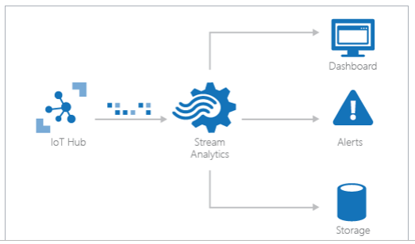
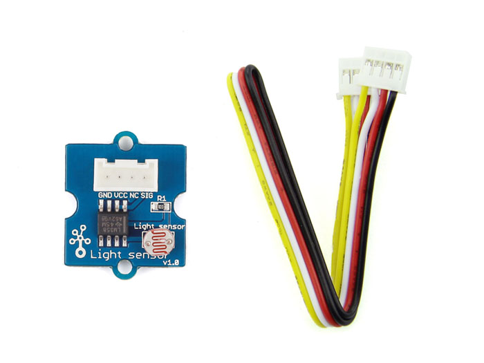

*---*

*layout: post*

*title: "Add title with customer name here"*

*author: "Add author name here"*

*author-link: "\# Include twitter link here"*

*\#author-image: "{{ site.baseurl }}/images/authors/photo.jpg"*

*date: 2016-05-19*

*categories: [IoT]*

*color: "blue"*

*\#image: "{{ site.baseurl }}/images/imagename.png" \#should be \~350px tall*

*excerpt: Add a short description of what this article is about, helping a
fellow developer understand why they would want to read it. What value will they
get out of reading it? Focus on the problem or technologies and let that be the
guiding light.*

*language: The language of the article (e.g.: [English])*

*verticals: The vertical markets this article has focus on (e.g.: [Energy,
Manufacturing & Resources, Financial Services, Public Sector, “Retail, Consumer
Products & Services”, Environmental, Communications/Media, Transportation &
Logistics, Smart Cities, Agricultural, Environmental, Healthcare, Other])*

*---*

\#\# Introduction \#\#
======================

Ocean Of Things was born in 2014 as a CCONEC project (Cognitive Changes In
Oceanic Navigation in Extreme Conditions). It was specifically built for the
Barcelona World Race 2015 edition.

The Ocean Of Things team is made up of members who are experts on creating
solutions that connect people, devices and services around the wireless
supervision, control and data acquisition.

The team aspires to create the scientific sailboat to be used in the next
edition of the Barcelona World Race. The aim is to provide technological
platforms with technological innovation, that includes the design and testing of
new products of research and innovation within the nautical world of regattas.

Boat “One Planet One Ocean”

The project, Ocean of Things, is composed of two parts:

1.  **data acquisition**

-   In the first part, we have some sensors connected to a PLC (that will be a
    Dragon Board or an Intel Joule). Since boats easily get wet, we have two
    sets of computer system, with the exact same architecture, in case one
    malfunctions when water gets in.

-   The sensors include those for temperature, humidity, brightness, color, and
    barometer. We have a local copy of these data in an SD. Since most of the
    time they won’t have connection, we will do the synchronization once they
    have connectivity.

    The journey will be documented and all its data included. All these data,
    collected by performing a series of tasks to get information about the state
    of our oceans, will then be interpreted and processed by experts.

    Those scientific programs are: [surface temperature and salinity levels of
    seawaters](http://www.vg2016.com/salinity/), [citclops
    project](http://www.vg2016.com/proyecto-citclops/#fnoben), [argo
    beacons](http://www.vg2016.com/balizas-argo/#fnoben), and [microplastics and
    other contaminants](http://www.vg2016.com/microplastics/#fnoben).

    *(add more description about these programs if it’s necessary. It’s not
    relevant for the project, but it’s interesting)*

1.  Boat AutoPilot

-   The boat has an **NMEA** *Instrumentation Bus.*

With this device, they can gather crucial data like the torsion and tension of
the main mast, efforts of the cables or sails, the magnitude or frequency of
waves.

Not only can we get information, but we can also use the auto-pilot to configure
sails and do all that while the boat is continuously moving towards a particular
direction.

Last March 20, 2017, Microsoft held a three-day HackFest focused on IoT
technologies. Approximately twenty people from different departments of the
company helped seven customers across Europe to develop their projects.

During these three days, in the Ocean Of Things project, the following Microsoft
employees participated:

• Erica Barone, Technical Evangelist from Italy as IoT Mentor

• Isabel Cabezas, Technical Evangelist, Spain.

They helped the Ocean of Things team formed by:

• Pep Lluis Bano, Team Manager

• Irene Medina, Staff Manager

• Mikel Irazabal. Scientific

• Marc Mundo, Engineer

For the development of this project in the hackathon we used some sensors;
temperature, humidity, brightness, color and a barometer. All these are
connected and sending data to a physical gateway. This gateway saves the data
when the boat doesn't have Internet connection and eventually synchronizes it
once the boat establishes a connection.

Key Technologies:
-----------------

Windows IoT Core  
Visual Studio (C++/ C\# / nodeJS)  
Visual Studio Team Services  
Azure IoT Suite (IoT Hub, Azure IoT Gateway SDK)

NodeRed

Intel & ARM processors.  
Several types of sensors/devices and electronics.

\#\# Customer profile \#\#
--------------------------

The “OceanOfThings” Project was born in 2014 due to the common will of a few
people with the same interest in navigation and sport.

The team is composed of volunteers who combined their creativity, experience and
passion to carry out a common project. Among themselves, they have a total of
more than 32 years of experience working on Industrial Environments.

Their goal is to have a much higher level of efficiency and to get inspirations
that will result to the best solution in this seascape.

This project is not backed by a legal company and is funded by the personal
investments, of time and effort, of the group of technicians working on it.

All software created for this project was developed under open source software,
and it is absolutely a non-profit activity.

The team does not have an official physical office to develop this project. They
do it remotely, from their homes (distributed in several towns in the province
of Girona, Spain). From time to time, they gather together to follow up the
tasks, either at the home of one of the members or in a co-working space.

The members of this team have basically created their own non-profit
organization for this specific project related to IoT in a maritime environment.
In principle, it is not available either as a product or as a service.

<http://www.vg2016.com/>

<http://www.barcelonaworldrace.org/es/educacion/programa-educativo/explora/navegacion/el-imoca-60>

<http://www.barcelonaworldrace.org/es/equipos-2014-2015/one-planet-one-ocean-pharmaton>

### About the boat:

The model of the sailboats that are used in this competition is called IMOCA
Open 60.

IMOCA means “International Monohull Open Class Association”. The main task of
this international association is organizing regattas and [single
handed](https://en.wikipedia.org/wiki/Single-handed_sailing) circumnavigation
regattas.

The class, which is a development class, is the main focus of IMOCA. As the name
implies, the class is “open”. It means that it does not have any fixed designs
and instead is defined by a “box rule” which means that as long as it meets
certain restrictions (mostly for the security of the crew), any design is
permitted.

But at the same time there are plenty of scope for innovation and the
development of new ideas, quite revolutionary in this type of sailboats.

So each IMOCA 60 has their own features and properties. It is because of this
specific features and properties that the Machine Learning model generated for
this boat “One Planet, One Ocean” and its training will only be meaningful and
applicable for this boat.

\#\# Problem statement \#\#
===========================

Even with the advances in technology that we have today, going against natural
elements is still not an easy feat.

One perfect example of this situation is this project, the Ocean of Things.

Working with electronic components on an 18-meter boat in the middle of the
ocean is quite a challenging task.

We have faced several problems due to the inherent nature of the Project, like
unreliable data connection, poor availability of electricity, frequent water
splashes over our electronic components and lack of space in the boat.

Depending on the location and how far from the coast the boat is, our system
will have or not Internet connection available. The unreliable data link makes
it impossible to upload data to the cloud in real time.

In the hackfest, we tried several scenarios with and without connection to test
the process of data saving in a local database. We then tested sending data to
the cloud and the automatic synchronization in the case the data is saved in the
local hdd and also when it gets the internet connection back.

For the electrical installation in the boat, we only have an electric line of 15
volts and an 5 ampere. So all of our system architecture has to work strictly
within this unyielding tight limits. It is not possible to connect
systems/hardware which require more electrical power than that.

Since boats and all its content easily get wet, we have two identical systems,
with the exact same sensors: temperature, humidity, brightness, color and a
barometer.

Although we have all our system in a watertight box and we trust that the water
will not get in, we prefer to have a backup system, and everything duplicated.
For good measure, we are not thinking about data redundancy in this case.
Because in the event the system doesn’t work, we could lose months of
irretrievable data.

The “One planet, one ocean” boat is an IMOCA 60 yachts, specially designed for
solo and double-handed ocean sailing. The length is 60 feet (18.29 meters) and
the draught is 4.5 meters: so, only have small cabin where two people has to
live continually for three months.

They don’t have so much space for themselves. They sleep in a deckchair and need
to store food for three months.

The lack of space it’s why our computer system can’t be very big, we have some
size restriction and the package with the watertight box shouldn’t be bigger
than 0.30m\^3

Fortunately, the technical team who was part of the project has a lot of
experience: over 12 years. They are very knowledgeable about IoT, electronics
and telecommunications.

[Check] We should design a system that could be remotely maintained: fix and
update. Because if something fails in the middle of the ocean, our technical
team won’t be able to have physical access to it.

In the initial state, the synchronization was implemented from scratch in C.
Everything was coded and they didn’t use any library nor the Azure SDK.

Obviously, we didn’t have the boat in Madrid, so we couldn’t get access to the
original NMEA Instrumentation Bus during the development/hackfest.

The team didn’t have any kind of experience with Machine Learning, and the aim
was abstract and confused, we didn’t have any data scientist, nor a sailor or
someone who has the know-how for the recovery of data which could be analyzed
for the Machine Learning Algorithm.

\#\# Solution and steps \#\#
============================

Previous work (done before the HackFest)
----------------------------------------

We can’t have the boat in Madrid nor access to the original NMEA Instrumentation
Bus during the development/hackfest. So we have to mock the device and the data
it generates.  
Before the hackfest, during the trainings of the last few months, data was being
saved for having real data generated by the NMEA instrumentation Bus to be used
during the HackFest.

In the previous edition of the Barcelona World race, when the boat "One ocean,
one planet" sailed during the race, they already stored the data that generated
the sensors. The code developed then is OpenSource and you can find it in this
github repository: <https://github.com/mirazabal/OceansOfThings>

Hardware
--------

For the development of this project in the hackathon we used some sensors;
temperature, humidity, brightness, color and a barometer. All these are
connected to an [Intel
Joule](https://software.intel.com/en-us/iot/hardware/joule) that collects the
sensor data and sends it to a physical gateway. This gateway saves the data when
the boat doesn't have Internet connection and eventually synchronizes it once
the boat establishes a connection.

The first thing that we did in the HackFest, was build the same architecture
system that will be used inside the boat. We worked with exactly the same kind
of sensors and architecture.

You can see details about the used hardware in “Technical delivery” Section.
[Link]

Organization of work during the hackfest.
-----------------------------------------

The group was divided into two teams.

The aim of the first team was to make a rapid prototype.

After making this prototype, data will be sent to the cloud through an IoT Hub
instance and then we will start to analyze them and build a dashboard with Power
BI.

The second team worked with Azure Gateway SDK. They started a proxy that
established communication with the Cloud. The proxy’s function is to send the
data to the cloud through an IoT Hub and control the synchronization when the
device is offline.  
Unfortunately, the work with the Azure Gateway SDK couldn’t be completed during
the HackFest. We don’t have a reliable and finalized version of the designed
system with the Azure Gateway SDK.

NodeRed Prototype
-----------------

Development boards, called “CAP”, as shown in the illustration below, have the
sensors connected and they gather data from them with a C++ application that you
can find in this Github Respository:

<https://github.com/mirazabal/OceansOfThings/tree/master/IoT_Node>

This code is also responsible for saving these recovered data in the local
database, represented as an “SD card”.

The data are then stored in a database inside the gateway, where we also have a
NodeRED service running a script that will select the most recent data saved in
the DB that have not been sent yet to the cloud.

Still in relation to that, we have a column in the table to keep track whether
the row was already sent or not.

C:\\Users\\isacabe\\AppData\\Local\\Microsoft\\Windows\\INetCache\\Content.Word\\cap4.png

C:\\Users\\isacabe\\AppData\\Local\\Microsoft\\Windows\\INetCache\\Content.Word\\cap4.png

After getting *not-sent* data from the database, we send these data through
Azure IoT Hub:

C:\\Users\\isacabe\\AppData\\Local\\Microsoft\\Windows\\INetCache\\Content.Word\\cap6.png

C:\\Users\\isacabe\\AppData\\Local\\Microsoft\\Windows\\INetCache\\Content.Word\\cap6.png

And after successfully sending it, we then update the local database column to
flag it like “sent”.

C:\\Users\\isacabe\\AppData\\Local\\Microsoft\\Windows\\INetCache\\Content.Word\\cap1.png

C:\\Users\\isacabe\\AppData\\Local\\Microsoft\\Windows\\INetCache\\Content.Word\\cap1.png

Using Stream Analytics to save data from IoT Hub to Document DB
---------------------------------------------------------------

We used Azure DocumentDB as NoSQL database for saving data we collected from the
sensors we have in the boat. We have chosen [Azure
DocumentDB](https://azure.microsoft.com/services/documentdb/) for its high
availability and guaranteed low latency and high throughput.

For building this architecture, we created an IoTHub service and then we
registered the Intel Joule as a device.

The id and key for the device were used in the NodeRED flow to connect the
device with IoTHub and start sending data from the gateway.

### Creating a Stream Analytics to connect the Iot Hub and the Document DB:

Once we have the data arriving to IoT Hub, we can connect it as an input for a
Stream Analytics Job, that we will use to store all the incoming data into a
DocumentDB collection.

For this, we created the job:

And then we defined the IoT Hub as an input:

The output of the job was connected to an already created DocumentDB collection:

\+ Output

\+ Query

In order not to further encumber our first test of Stream Analytics, we add a
simple query:

And finally we started the Stream Analytics job:

When the job finished to start up, we began to see the outputs in the
DocumentDB:

1.  [./media/image24.png](../../../Desktop/Ocean%20Of%20Things/media/image24.png)

Building a graph from the boat data with PowerBI
------------------------------------------------

Now, exporting data from Document DB into Power BI, we can create a dashboard to
visualize the data:

Now, we are going to walk through the steps on how to connect to a DocumentDB
account in Power BI Desktop, navigate to a collection where we want to extract
the data using the Navigator, and transform JSON data into tabular format using
Power BI Desktop Query Editor.

To get data from a DocumentDB, click on the expander at the right side of the
**Document** column header (red mark) and see all the data, and the “Close &
Apply” (green mark) to build the graphs.

[Tip] If you can’t remove the function “count” applied to each column, try “Edit
Queries” instead and change the type of the column to “number”:

Finally, we created a dashboard to visualize the data in some different charts,
see the average temperature, and be able to pin the data visualizations to a
dashboard for near real-time updates.

AutoPilot with MachineLearning
------------------------------

The **NMEA** *Instrumentation Bus 0183*, is a kind of control panel for the
boat.

Original Schema:

With this device, they have access to different data like the torsion and
tension of the main mast, efforts of the cables or sails, as well as the
magnitude or frequency of waves. Not only can we get information, but we can
also use the auto-pilot to configure sails and do all that while the boat
continuously moves to particular direction.

It will be connected via a USB port to the main PC.

The kind of bus for the data extraction is similar to the standard
[RS485](https://en.wikipedia.org/wiki/RS-485) and the extraction will be done in
an MQTT format.

The NMEA Instrumentation Bus is a big central system totally integrated in the
boat. It drives 3 NKE hydraulic drives and has one LG screen monitor installed
in the master cabin.

As expected, we could not possibly bring the boat to the HackFest. The only way
to develop the solution is to mock the data.

We used a Raspberry Pi 3, and data was recovered in the last trainings of the
boat for simulating the NMEA Instrumentation Bus of the boat.

We simulated real data (of a navigation tool) with a Raspberry Pi 3 and we used
this data for creating a Machine Learning Model, whose final objective is to
create the Automatic Pilot of the Boat.

The simulated architecture of our model is represented in this schema:

The version of MQTT we used is Mosquitto, and the library for node.js we used is
called MQTT.js, available in NPM.

<https://www.npmjs.com/package/mqtt>

In our scenario, the Raspberry Pi 3 will be the “broker” of the MQTT
communication and the gateway will be the client. The script hosted on the
Rasberry PI 3 is not longer than 10 lines: read the data from our csv file with
recopiled data, connect and publish (basic methods of library MQTT.js) that you
can read in the simple example of the documentation:
<https://www.npmjs.com/package/mqtt>

The MQTT client, in our scenario is the proxy/gateway, at the moment of the
simulation was built in Node-Red. This step doesn’t has any difficulty. Just
cunfigure the mqtt imput node with broker address and topic, convert the recived
string in a JSON and analyze.

http://noderedguide.com/wp-content/uploads/2015/11/Node-RED-Lecture-3-Basic-nodes-and-flows-2.jpg

http://noderedguide.com/wp-content/uploads/2015/11/Node-RED-Lecture-3-Basic-nodes-and-flows-2.jpg

Send the processed data we need to the IoT Hub

Resultado de imagen de node red ioT hub

Resultado de imagen de node red ioT hub

Saving data from IoT Hub in a DocDB.
------------------------------------

We saved data from IoT Hub following the same steps we did in the before section
“Using Stream Analytics to save data from IoT Hub to Document DB” [link]

Using Stream Analytics, the IoT Hub like input and the DocumentDB as output.

Import data Into Machine Learning Studio from DocumentDB
--------------------------------------------------------

We are clear about machine learning is not a solution for every type of problem,
but in this case we can’t determine a target value by using simple rules,
computation o predetermined steps.

Sailing techniques are complex and it cannot be adequately solved using a simple
rule-based solution. A large number of weather factors could influence in the
sailing.

No one in our team had a extensive experience working with Machine Learning, so
we rely on the [official Azure Machine Learning
documentation](https://docs.microsoft.com/en-us/azure/machine-learning/machine-learning-algorithm-choice)
to choose the machine learning algorithm we used.

The connection from the DocumentDB where we saved our data, to our new
experiment of machine learning is very easy to create.

In the “Import Data” node, we can look the sucesfully imported data from
DocumentDB and data themselves if we select “Visualize” in the contextual menu:

The lack of Data Scientist or a Technical Sailor expert did we could achieve a
first approximation of the Machine Learning. Is undoubtedly a first step,
although the confidence level of the model doesn’t allows us put in in the boat
at the moment.

When we took a look about data the boat / NMEA Instrumentation Bus recollected,
we imagine what these data meaning and their influence in the future navigation
delegate to the autopilot.

Fortunately, despite of our lack of experience, the Azure Machine Learning
Studio tool is an easy-to-use, drag-and-drop tool that allows us to create a
POC: an easy first “Machine Learning” Model in some hours.

We chose a subset of columns from the dataset. We weren’t so sure, but the
weather features influences in the sailing could be:

**Wind Direction**  
Wind Speed

Sea Surface Temperature

Air Temperature

Sea Level Pressure  
**Wave Period**  
**Wave Height**

**Swell Direction**

**Swell Period**

**Swell Height**

Heading (degrees)

Halyard this is the result we want to calculate.

<https://msdn.microsoft.com/library/en-us/Dn905978.aspx>

We built several lineal regression algorithms to compare them:

We add another aproximation method in the Linear Regression. In the first one,
we use least squares and in the other one, gradient descent:

We tried several regression algorithms to compare their precision:

\#\# Technical delivery \#\#
============================

The first we did in the HackFest, was build the same architecture system that
will be inside the boat. We worked with the exactly same kind of sensors and
architecture.

Intel Joule
-----------

We used this powerful system on module, the Intel Joule, to connect all our
sensors to build this modular architecture, since we feel that is the best way
to allow developers to quickly make changes and update the system, maintain the
option of open up new possibilities.

Resultado de imagen para intel joule

Resultado de imagen para intel joule

Resultado de imagen para intel joule

Resultado de imagen para intel joule

[Specs](https://software.intel.com/en-us/articles/joule-vs-edison): This small
package contains an Intel® Atom™ quad-core processor, clocked at an impressive
1.7 GHz, with 4 gigabytes of LPDDR4 RAM, a dual band Wi-Fi antenna, Bluetooth®,
and an Intel® HD Graphics processing unit. These specs make the Intel Joule
module more powerful than any development board previously created by Intel.

Temperature
-----------

Resultado de imagen de sensor temperature grove

Resultado de imagen de sensor temperature grove

<https://seeeddoc.github.io/Grove-Temperature_Sensor/>  
The Grove - Temperature Sensor uses a
[Thermistor](http://www.legacydistribution.co.uk/downloads/NTC-thermistors/TTC03.pdf)
to detect the ambient temperature.

Humidity**:**

https://github.com/SeeedDocument/Grove-Temperature\_and\_Humidity\_Sensor\_Pro/raw/master/img/Temp\_humi\_pro.jpg

https://github.com/SeeedDocument/Grove-Temperature\_and\_Humidity\_Sensor\_Pro/raw/master/img/Temp\_humi\_pro.jpg

<http://wiki.seeed.cc/Grove-Temperature_and_Humidity_Sensor_Pro/>

The detecting range of this sensor is 5% RH - 99% RH, and -40°C - 80°C.

Barometer:
----------

Grove - Barometer Sensor barometric pressure and barometric temperature

https://raw.githubusercontent.com/SeeedDocument/Grove-Barometer\_Sensor/master/img/Grove-Barometer.jpg

https://raw.githubusercontent.com/SeeedDocument/Grove-Barometer\_Sensor/master/img/Grove-Barometer.jpg

<http://wiki.seeed.cc/Grove-Barometer_Sensor/>

This Grove - Barometer Sensor features a Bosch BMP085 high-accuracy chip to
detect barometric pressure and temperature.

Light sensor:
-------------

https://github.com/SeeedDocument/Grove\_Maker\_Kit\_for\_Intel\_Joule/raw/master/img/grove%20-%20light%20sensor.jpg

https://github.com/SeeedDocument/Grove\_Maker\_Kit\_for\_Intel\_Joule/raw/master/img/grove%20-%20light%20sensor.jpg

The [Grove - Light
sensor](https://www.seeedstudio.com/Grove-Light-Sensor-p-746.html) module uses
GL5528 photoresistor(light dependent resistor) to detect the intensity of light
in the environment

<https://www.seeedstudio.com/Grove-Light-Sensor-p-746.html>

Gateway (IBX-300BC)
-------------------

Resultado de imagen de ibx-300BC

Resultado de imagen de ibx-300BC

<http://www.ieiworld.com/files/file_pool/0A359000043549293678/file/IBX-300BC_UMN_v1.02.pdf>

Raspberry Pi 3
--------------

This compute module is the development board to mock the NMEA Instrumental Bus.

https://www.raspberrypi.org/app/uploads/2016/02/Raspberry-Pi-3-top-down-web.jpg

https://www.raspberrypi.org/app/uploads/2016/02/Raspberry-Pi-3-top-down-web.jpg

Specs:

A 1.2GHz 64-bit quad-core ARMv8 CPU

802.11n Wireless LAN

Bluetooth 4.1 and Bluetooth Low Energy (BLE)

1GB RAM, 4 USB ports, 40 GPIO pins

Full HDMI port, Ethernet port, Combined 3.5mm audio jack and composite video

Camera interface (CSI), Display interface (DSI)

Micro SD card slot (now push-pull rather than push-push)

VideoCore IV 3D graphics core

\#\# Conclusion \#\#
====================

*The code developed in the hackfest is a first step for a more ambitious
project. At the moment, we are collecting high quality data and send them to the
cloud (in arduous conditions as we have seen). This data will be used by the
technical team for creating a machine learning model that will improve the boat
navigation in the future.*

The major difficulties of the project have consisted on adapting a system
designed to the special aspect of this project naturally. Nevertheless, we have
a wide variety of sensors, systems and technology nowadays. And this rich
diversity enabled us to solve most of these challenges.

*This Project shown us the ease of using tools like NodeRed for developing a
pilot test. In only one day we could save data into the DocumentDB database and
build graphs.*

*In addition, thanks to the technology agnostic of services like IoT Hub,
DocumentDB, PowerBI, NodeRed… we could change some developed modules instead
other ones, without remake not a single line of code. We started with a POC with
NodeRed, while other group did tests with Gateway SDK, and we could easily
replace them.*

We needed a secure, easy and reliable data synchronization. As we had seen there
are a lot of tools that allow us to do these tasks by automated means: IoT Hub,
NodeRed and Azure Gateway SDK provide us the needed reliability and security.

We worked with a simplified dataset to create a first pilot of the machine
learning model. This model is not finished yet. The navigation will depend on
more features than the ones we initially selected. Sailing and building a
machine learning model are very complex activities. Since in the hackfest we
didn’t have any sailor nor any data scientist to help us with that, we wanted to
keep it simple for the POC so it was easy to build and understand.

Building the machine learning model was easy with Azure ML, as the client team
has been able to see for themselves. Even though they will need a mean to run
the prediction in the field, we could easily build a first model in ML studio in
the cloud to test different algorithms and see which one would better fit with
the data.

Everytime the boat approaches to the coast and has data connection, the
collected data will be send to the cloud. The machine learning model will be
retrained with this information to enhance the trained model. This means the
autopilot continues improving even the technical team is at the other side of
the world.

*Even with the advances in technology that we have today, going against wild
weather conditions is still not an easy feat, and one perfect example of this
situation is this project, the Ocean of Things.*

\#\# Additional resources \#\#
==============================

Madrid IoT HackFest video:

(pending)

Intel Joule information:

<https://software.intel.com/en-us/iot/hardware/joule>

Official GitHub Repository of Ocean Of Things project:
<https://github.com/mirazabal/OceansOfThings>

GitHub Repository we used while the HackFest:

<https://github.com/isabelcabezasm/OceanOfThings>

Documentation about target Azure DocumentDB for JSON output from Stream
Analytics

<https://docs.microsoft.com/en-us/azure/stream-analytics/stream-analytics-documentdb-output>

Creating a connection from an IoT Hub to DocumentDB, using Stream Analytics,
step by step:

<https://docs.microsoft.com/en-us/azure/stream-analytics/stream-analytics-build-an-iot-solution-using-stream-analytics>
